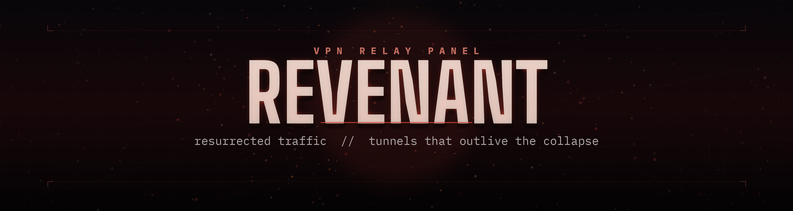

# Revenant

[](https://github.com/ItzHosseinYc/Revenant/releases/tag/v1.0.0)
[](LICENSE)


<p align="center">
  
</p>

A one-click desktop VPN panel built for networks that fight back. Press **Connect** — Revenant handles route discovery, tunnel setup, and everything in between, so you never touch a command line.

## ✨ Features

- **Auto mode** — one button, zero config. Connects using your last working setup or sensible defaults on first run.
- **Advanced panel** — full control when you want it:
  - **Protocol**: MASQUE (disguised as normal HTTPS), WireGuard (lighter, faster), or WARP-in-WARP (double-tunneled for extra security)
  - **Scan Mode**: Turbo, Balanced, Thorough, or Stealth
  - **IP Version**: IPv4, IPv6, or both
  - **MASQUE Transport**: HTTP/3 for speed, HTTP/2 where UDP is throttled or blocked
  - **Quick reconnect**: retests the last known-good gateway before running a full scan
- **Live progress** — real elapsed time and an actual percentage, not a fake spinner.
- **Self-healing reconnect** — drops mid-session trigger automatic retries with backoff, shown as "Reconnecting… (attempt N of 3)" instead of dying silently. Manual disconnects are never auto-retried.

## 📦 Installing

Grab the latest installer from the [Releases page](https://github.com/ItzHosseinYc/Revenant/releases/tag/v1.0.0):

- `Revenant-GUI_x.y.z_x64-setup.exe` — standard installer (recommended)
- `Revenant-GUI_x.y.z_x64_en-US.msi` — MSI package, for scripted or enterprise installs

Windows x64 only for now — see [Building from source](#building-from-source) for other platforms.

## 🛠 Building from source

1. **Prerequisites**
   - [Node.js](https://nodejs.org/) and npm
   - [Rust](https://rustup.rs/) (stable toolchain)
   - Tauri's platform prerequisites — see the [Tauri v2 prerequisites guide](https://v2.tauri.app/start/prerequisites/)

2. **Install dependencies**
   ```sh
   npm install
   ```

3. **Run in development mode**
   ```sh
   npm run tauri dev
   ```

4. **Build a release installer**
   ```sh
   npm run tauri build
   ```
   Installers land under `src-tauri/target/release/bundle/`.

## ⚙️ How it works

- **Frontend**: React 19 + Tailwind, animated with [Motion](https://motion.dev/), talking to the Rust backend over Tauri's IPC. Lightweight by design — animations pause while the window is unfocused.
- **Backend**: Rust, spawning the tunnel process in a real pseudo-terminal and streaming its output live to the GUI's log panel.
- **Ground truth for "connected"**: a successful local SOCKS5 connection is treated as proof the tunnel is actually up — not just log text.
- **State machine**: `Idle → Launching → Connecting → Connected`, with `Reconnecting` (auto-retry, capped at 3 attempts) and `Error` as the two outcomes that need your attention.

---

*Tunnels that outlive the collapse.*

## License

AGPL v3 — see [LICENSE](LICENSE) for details.
